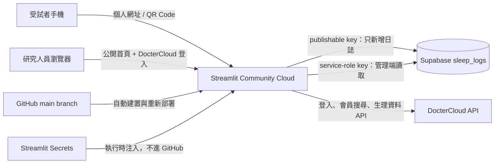
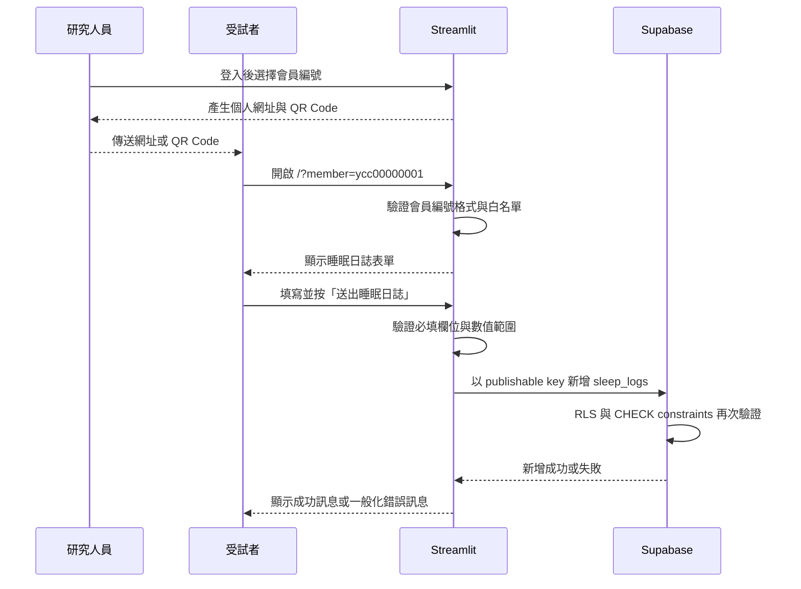

# 深睡體驗營：公開 Streamlit 睡眠研究平台

本專案將原本只能在本機／區網使用的睡眠日誌與研究監控工具，整理成一個可由外部網路存取的 Streamlit 網站。受試者使用個人連結或 QR Code 填寫每日睡眠日誌；研究人員則從同一個網址登入，整合 DocterCloud 生理資料與 Supabase 睡眠日誌進行分析。

## 正式環境

| 項目 | 目前設定 |
| --- | --- |
| 公開網站 | [https://eye-mask-sleep-monitor.streamlit.app](https://eye-mask-sleep-monitor.streamlit.app) |
| GitHub | [yuntechaiot/eye-mask-sleep-monitor](https://github.com/yuntechaiot/eye-mask-sleep-monitor) |
| 部署平台 | Streamlit Community Cloud |
| 部署分支 | `main` |
| 程式入口 | `streamlit_app.py` |
| Python | 3.12 |
| 時區 | `Asia/Taipei` |
| 受試者編號 | `ycc00000001` ～ `ycc00000050` |

研究人員首頁：

```text
https://eye-mask-sleep-monitor.streamlit.app/
```

受試者個人填寫頁範例：

```text
https://eye-mask-sleep-monitor.streamlit.app/?member=ycc00000001
```

> [!IMPORTANT]
> 正式收集健康資料前，請先完成「正式收案前的 Supabase 安全強化」。尤其要先在 Streamlit Secrets 設定 `SUPABASE_ADMIN_KEY`，再執行 `database_schema_supabase.sql`。若直接關閉公開讀取而未設定管理金鑰，研究端將無法取得睡眠日誌。

## 目前完成狀態

| 項目 | 狀態 | 說明 |
| --- | --- | --- |
| 公開 GitHub 儲存庫 | 已完成 | 部署檔案已上傳，真實 Secrets 未提交。 |
| Streamlit 公開部署 | 已完成 | 公開首頁已可由外網開啟。 |
| 受試者路由 | 已完成 | 已驗證 `?member=ycc00000001` 可正常顯示表單。 |
| Streamlit Secrets | 已完成基本設定 | 已設定 Supabase URL、publishable key、公開網站 URL 與 DocterCloud API URL。 |
| `SUPABASE_ADMIN_KEY` | 待設定／待確認 | 正式關閉匿名讀取前必須設定。 |
| Supabase 安全 SQL | 待人工確認 | 必須在 Supabase SQL Editor 執行並確認 RLS 政策。 |
| 正式資料寫入測試 | 尚未執行 | 部署驗證時刻意沒有送出假睡眠資料，避免污染正式資料庫。 |

---

## 1. 系統角色與入口

同一個 Streamlit 應用程式依網址是否含有 `member` query parameter，切換成不同介面。

| 使用者 | 入口 | 是否登入 | 能做的事 |
| --- | --- | --- | --- |
| 受試者 | `/?member=ycc00000001` | 不需要 | 填寫並新增自己的睡眠日誌。 |
| 研究人員 | `/` | 需要 DocterCloud 帳密 | 搜尋會員、設定查詢區間、查看生理趨勢、睡眠階段、衍生指標與已送出的日誌，並產生個人 QR Code。 |
| 無效連結訪客 | `/?member=<不合法值>` | 不適用 | 只會看到「無效的會員連結」，不會進入表單或後台。 |

路由由 `streamlit_app.py` 的 `main()` 控制：

1. 讀取 `st.query_params["member"]`。
2. 將會員編號轉成小寫並移除頭尾空白。
3. 檢查格式是否為 `ycc` 加 8 位數字。
4. 再檢查編號是否位於固定名單 `ycc00000001`～`ycc00000050`。
5. 合法時顯示受試者睡眠日誌；沒有 `member` 時顯示研究人員入口。

---

## 2. 整體架構



### 元件職責

#### GitHub

- 保存可公開的 Python 原始碼、套件版本、主題設定與 SQL schema。
- 不保存 Supabase 真實金鑰、DocterCloud 帳密或受試者資料。
- `main` 分支有新 commit 時，Streamlit Community Cloud 會自動重新部署。

#### Streamlit Community Cloud

- 執行 Python 伺服器端程式。
- 依網址切換受試者與研究人員畫面。
- 保存加密 Secrets，並在執行時提供給程式。
- 對外提供 HTTPS 網址。

#### Supabase

- 保存受試者主觀填寫的睡眠日誌。
- 匿名公開頁只應有 `INSERT` 權限。
- 研究端使用 `SUPABASE_ADMIN_KEY` 讀取指定會員與日期的日誌。
- RLS 政策負責阻止公開 `SELECT`、`UPDATE` 與 `DELETE`。

#### DocterCloud

- 驗證研究人員帳號與密碼。
- 提供會員清單與穿戴裝置生理資料。
- 提供睡眠、血壓、心率、血氧、體溫及 HRV 等 API。

---

## 3. 受試者完整流程



### 3.1 研究人員建立個人連結

1. 開啟公開網站根目錄。
2. 在左側使用 DocterCloud 研究人員帳密登入。
3. 展開「會員填寫連結 / QR Code」。
4. 選擇會員編號。
5. 系統依 `PUBLIC_APP_URL` 組合網址：

   ```text
   https://eye-mask-sleep-monitor.streamlit.app/?member=<會員編號>
   ```

6. 可直接開啟、複製網址或下載 PNG QR Code。
7. 將該會員的專屬連結提供給對應受試者。

> 目前會員編號是可預測的流水號，不等同於安全登入憑證。請不要把會員連結公開張貼。若研究規模擴大，建議改為不可猜測的隨機 token。

### 3.2 受試者填寫內容

| 分類 | 欄位 | 驗證／預設值 |
| --- | --- | --- |
| 基本資料 | 姓名 | 必填，最多 80 字。 |
| 基本資料 | 填寫日期 | 預設台灣當天，不允許未來日期。 |
| 耳機使用 | 使用分鐘數 | 0～600，預設 0，每次增減 5 分鐘。 |
| 入睡狀況 | 躺上床時間 | 預設 23:00。 |
| 入睡狀況 | AM／PM | `PM` 或 `AM`。 |
| 入睡狀況 | 入睡所需分鐘 | 0～300，預設 15。 |
| 睡眠中斷 | 夜間醒來次數 | 0～20。 |
| 睡眠中斷 | 能否睡回去 | 未曾醒來、馬上、需要時間、不能。 |
| 干擾因素 | 人／事／物／無 | 所有選項直接顯示、可點選複選；至少選一項，「無」不可與其他選項同時出現。 |
| 干擾因素 | 干擾程度 | 直接點選 0～5 的數字，不使用刻度條。 |
| 起床狀況 | 今天醒來時間 | 預設 07:00。 |
| 起床狀況 | 今天離床時間 | 預設 07:15。 |
| 睡眠品質 | 主觀品質 | 直接點選 1～5 的數字，預設 3，不使用刻度條。 |

### 3.3 送出時發生的事

1. Streamlit 在伺服器端將欄位整理為一筆 `row`。
2. `validate_form()` 先驗證姓名、分鐘、次數、干擾因素與評分範圍。
3. 驗證失敗時只顯示欄位錯誤，不會連線到資料庫。
4. 驗證成功後，以 `SUPABASE_URL` 與 `SUPABASE_KEY` 建立 Supabase client。
5. 對 `sleep_logs` 執行 `INSERT`。
6. Supabase 的 RLS 與資料表 constraint 再驗證一次。
7. 成功時顯示「日誌已送出」並清空表單。
8. 失敗時顯示一般化錯誤，不把金鑰、資料庫錯誤或內部 stack trace 洩漏給受試者。

公開填寫頁不提供下列功能：

- 不列出任何會員名單。
- 不讀取或顯示歷史睡眠日誌。
- 不匯出 CSV。
- 不提供修改或刪除按鈕。
- 不顯示 Supabase URL 或 API key。

---

## 4. 研究人員完整流程

### 4.1 登入

1. 開啟 [公開網站首頁](https://eye-mask-sleep-monitor.streamlit.app)。
2. 在左側輸入 DocterCloud 研究人員帳號與密碼。
3. Streamlit 伺服器將帳密透過 HTTPS 送至：

   ```text
   POST https://icare.docter.pro/back-end/app/login/researcher
   ```

4. 登入成功後，伺服器端暫存 `access_token` 30 分鐘；瀏覽器只持有隨機登入識別碼，不持有 DocterCloud token 或密碼。
5. 30 分鐘內重新整理首頁可恢復登入；超過 30 分鐘後再次重新整理，需重新登入。應用程式重新啟動也會使現有登入失效。
6. 若希望下次不用重打帳密，請在自己的瀏覽器提示時選擇儲存密碼；這由瀏覽器的密碼管理員處理，不是網站的「記住我」功能。共用電腦請勿儲存。
7. 按「登出」會撤銷目前的伺服器端登入狀態並清除登入識別碼；瀏覽器密碼管理員儲存的帳密需在瀏覽器內另外移除。

DocterCloud 帳密不會寫入 GitHub、Supabase 或 Streamlit Secrets。

### 4.2 搜尋會員

1. 在左側「搜尋」輸入會員帳號或關鍵字。
2. 系統帶著 Bearer token 呼叫 DocterCloud `/user`。
3. 每頁取得會員清單，最多查詢 10 頁。
4. 從搜尋結果選擇會員。
5. 選定的會員只保存在目前 Streamlit session。

### 4.3 設定資料區間

左側可設定：

- 開始日期與時間。
- 結束日期與時間。
- 是否顯示趨勢連線。
- 是否每秒自動刷新。
- 要顯示哪些生理數據。

日期時間會以 `Asia/Taipei` 時區轉換成 Unix timestamp，再傳給 DocterCloud API。

### 4.4 取得與顯示資料

研究監控室可處理：

- 睡眠階段。
- 血壓。
- 心率。
- 血氧。
- 體溫。
- HRV LF/HF。
- HRV fatigue。
- HRV TP、LF、HF、VLF。

同一個 API path 的資料會在一次畫面更新中共用，避免 HRV 不同圖表重複呼叫相同 API。

### 4.5 睡眠資料清洗

DocterCloud 可能回傳重疊或子集合的睡眠紀錄，系統會：

1. 將 API 可能出現的 `emd_time` 修正成 `end_time`。
2. 對相同 `start_time` 只保留結束時間最晚的紀錄。
3. 對彼此重疊的區間保留時間最長的一筆。
4. 將細節依開始時間排序。
5. 依 type 轉成清醒、REM、淺睡、深睡或零星睡眠。
6. 將每個睡眠區段與同期心率、血壓資料配對。

### 4.6 Supabase 日誌與手錶資料配對

研究端會使用會員的 identifier 與睡眠日期查詢 `sleep_logs`：

1. 若手錶入睡時間在凌晨 00:00～11:59，優先查前一天的日誌，再查當天。
2. 若手錶入睡時間在中午以後，優先查當天，再查前一天。
3. 若日誌躺床時間與手錶入睡時間相差超過 8 小時，視為配對失敗。
4. 查詢成功後，使用主觀日誌的躺床／離床時間與手錶數據計算衍生指標。

### 4.7 衍生睡眠指標

| 指標 | 計算方式 |
| --- | --- |
| 整體躺床時間 | 日誌離床時間 − 日誌躺床時間；若為跨夜則自動加一天。 |
| 整體入睡時間 | 手錶睡眠結束 timestamp − 手錶睡眠開始 timestamp。 |
| 睡眠潛伏期 | 手錶偵測入睡時間 − 日誌躺床時間，最小為 0。 |
| 夜間醒來次數 | 睡眠 detail 中 `type == 0` 的區段數。 |
| 入睡後醒來時間 | 使用手錶 API 的 awake 分鐘。 |
| 賴床時間 | 日誌離床時間 − 手錶睡眠結束時間，最小為 0。 |
| 睡眠效率 | 手錶實際睡眠分鐘 ÷ 整體躺床分鐘 × 100%，上限 100%。 |

若必要資料缺失，對應指標顯示 `N/A`，不以 0 代替未知值。

### 4.8 查看已送出的睡眠日誌

研究人員登入後，首頁會顯示兩個分頁：

- `健康監控`：原有的 DocterCloud 生理資料與睡眠分析。
- `睡眠日誌紀錄`：從 Supabase 查詢受試者已送出的表單。

日誌紀錄頁可以：

1. 選擇全部會員或單一會員。
2. 設定日誌日期範圍，預設顯示最近 180 天。
3. 依部分姓名篩選。
4. 查看紀錄數、會員數與平均睡眠品質。
5. 在表格查看完整表單欄位。
6. 展開單筆紀錄查看躺床、醒來、離床、干擾與睡眠品質等內容。

每次查詢最多載入 500 筆。此功能只會在 DocterCloud 研究人員登入後出現，並且必須設定 `SUPABASE_ADMIN_KEY`；目前僅提供查看，不提供修改、刪除或公開匯出。

---

## 5. 資料庫結構

主要資料表是 `public.sleep_logs`。

| 欄位 | 型別 | 用途 |
| --- | --- | --- |
| `id` | bigint identity | 主鍵。 |
| `member_id` | text | 會員編號。 |
| `name` | text | 受試者填寫姓名。 |
| `date` | text | 日誌日期，格式 `YYYY-MM-DD`。 |
| `headphone_min` | integer | 耳機使用分鐘。 |
| `sleep_time` | text | 躺床時間，格式 `HH:MM`。 |
| `sleep_time_ampm` | text | `AM` 或 `PM`。 |
| `sleep_onset_min` | integer | 入睡所需分鐘。 |
| `wakeup_count` | integer | 夜間醒來次數。 |
| `fallback_sleep` | text | 醒來後是否能再睡。 |
| `disturbance` | text | 以逗號串接的干擾因素。 |
| `disturbance_scale` | integer | 干擾程度 0～5。 |
| `morning_wake_time` | text | 主觀醒來時間。 |
| `wake_time` | text | 離床時間。 |
| `sleep_quality` | integer | 主觀睡眠品質 1～5。 |
| `created_at` | timestamptz | Supabase 建立時間。 |

索引：

```sql
create index if not exists sleep_logs_member_date_idx
  on public.sleep_logs (member_id, date desc, id desc);
```

此索引支援研究端依會員和日期查找最新紀錄。

---

## 6. 正式收案前的 Supabase 安全強化

### 6.1 為什麼需要兩把 key

| Secret | 使用位置 | 權限原則 |
| --- | --- | --- |
| `SUPABASE_KEY` | 受試者送出表單 | publishable／anon key，只允許符合 RLS 的 `INSERT`。 |
| `SUPABASE_ADMIN_KEY` | 研究人員監控室 | service-role key，用於伺服器端讀取日誌。 |

`SUPABASE_ADMIN_KEY` 可繞過 RLS，必須只存在 Streamlit Secrets 或本機未追蹤的 `.streamlit/secrets.toml`。不得放入：

- GitHub。
- HTML／JavaScript。
- README。
- QR Code 或網址。
- 瀏覽器 localStorage。
- Email、群組訊息或螢幕截圖。

### 6.2 建議執行順序

為避免研究後台中斷，請依序操作：

1. 登入 Supabase Dashboard。
2. 從 Project Settings／API Keys 取得 service-role key。
3. 到 Streamlit Community Cloud 的 App settings → Secrets。
4. 新增：

   ```toml
   SUPABASE_ADMIN_KEY = "<YOUR_SERVICE_ROLE_KEY>"
   ```

5. 儲存後等待約一分鐘，讓設定傳播。
6. 用研究帳號登入監控室，確認可以搜尋會員與讀取睡眠日誌。
7. 到 Supabase SQL Editor。
8. 完整執行 `database_schema_supabase.sql`。
9. 再測試研究端讀取。
10. 使用測試會員送出一筆明確標記的測試日誌，確認匿名 `INSERT` 正常。
11. 在 Supabase 後台刪除該測試資料；公開網站本身沒有刪除功能。

### 6.3 SQL 套用後的權限

`database_schema_supabase.sql` 會：

- 建立或保留 `sleep_logs`。
- 啟用 Row Level Security。
- 移除舊的公開 `SELECT` policy。
- 移除公開 `DELETE` policy。
- 只允許 `anon` 新增格式與數值合法的資料。
- 撤銷 `anon` 與 `authenticated` 對資料表的其他權限。
- 只提供匿名新增 identity row 所需的 sequence 權限。

預期結果：

| 操作 | 匿名 publishable key | service-role key |
| --- | --- | --- |
| INSERT 合法日誌 | 允許 | 允許 |
| SELECT 歷史資料 | 拒絕 | 允許 |
| UPDATE | 拒絕 | 允許 |
| DELETE | 拒絕 | 允許 |

### 6.4 安全驗收

正式收案前至少確認：

- [ ] GitHub 搜尋不到任何真實 API key。
- [ ] `.streamlit/secrets.toml` 沒有被 Git 追蹤。
- [ ] Streamlit Secrets 已設定 `SUPABASE_ADMIN_KEY`。
- [ ] Supabase RLS 已啟用。
- [ ] anon key 無法 `SELECT sleep_logs`。
- [ ] anon key 無法 `DELETE sleep_logs`。
- [ ] 合法會員仍可新增日誌。
- [ ] 無效會員連結無法進入表單。
- [ ] 研究帳號登入後仍可讀取所需日誌。
- [ ] Streamlit log 不會輸出 token、密碼或完整健康資料。

---

## 7. Secrets 與設定

### 7.1 完整範本

正式環境的 Streamlit Secrets 或本機 `.streamlit/secrets.toml` 應包含：

```toml
SUPABASE_URL = "https://<project-ref>.supabase.co"
SUPABASE_KEY = "<publishable-or-anon-key>"
SUPABASE_ADMIN_KEY = "<service-role-key>"
PUBLIC_APP_URL = "https://eye-mask-sleep-monitor.streamlit.app"
DOCTERCLOUD_BASE_URL = "https://icare.docter.pro/back-end/app"
```

### 7.2 各設定用途

| 設定 | 必要性 | 用途 |
| --- | --- | --- |
| `SUPABASE_URL` | 必要 | Supabase 專案 REST endpoint。 |
| `SUPABASE_KEY` | 必要 | 公開表單伺服器端新增日誌。 |
| `SUPABASE_ADMIN_KEY` | 正式環境必要 | RLS 強化後供研究端讀取日誌。 |
| `PUBLIC_APP_URL` | 建議設定 | 產生個人連結與 QR Code。 |
| `DOCTERCLOUD_BASE_URL` | 可省略 | 可覆寫 DocterCloud API；程式已有 production 預設值。 |

程式優先讀取 `st.secrets`，找不到時才回退到同名環境變數。

### 7.3 修改 Secrets

1. 開啟 Streamlit Community Cloud。
2. 找到此 App。
3. 開啟 Manage app／Settings。
4. 進入 Secrets。
5. 使用 TOML 格式修改。
6. 儲存後等待約一分鐘。
7. 重新載入公開網站並檢查 App logs。

不要在 TOML 中遺漏引號，也不要使用全形引號。

---

## 8. 本機開發與測試

以下指令以 Windows PowerShell 為例。

### 8.1 建立環境

```powershell
cd C:\Users\User\Downloads\eye_mask\eye_mask\software
python -m venv .venv
.\.venv\Scripts\Activate.ps1
python -m pip install --upgrade pip
python -m pip install -r requirements.txt
```

### 8.2 建立本機 Secrets

```powershell
Copy-Item .streamlit\secrets.toml.example .streamlit\secrets.toml
```

編輯 `.streamlit/secrets.toml`，填入真實設定。本機測試時：

```toml
PUBLIC_APP_URL = "http://localhost:8501"
```

`.streamlit/secrets.toml` 已被 `.gitignore` 排除，請勿使用 `git add -f` 強制加入。

### 8.3 啟動

```powershell
streamlit run streamlit_app.py
```

本機網址：

- 研究人員入口：`http://localhost:8501/`
- 受試者頁面：`http://localhost:8501/?member=ycc00000001`
- 無效連結測試：`http://localhost:8501/?member=invalid`

### 8.4 基本測試清單

- [ ] 首頁顯示研究人員登入，不列出會員資料。
- [ ] 合法會員連結顯示表單。
- [ ] 無效會員連結顯示錯誤並停止執行。
- [ ] 姓名空白時不能送出。
- [ ] 干擾因素「無」與其他選項同選時顯示錯誤。
- [ ] 合法測試日誌可以新增到 Supabase。
- [ ] 受試者頁看不到歷史日誌。
- [ ] DocterCloud 錯誤帳密無法登入。
- [ ] 正確帳密可搜尋會員。
- [ ] 選定會員後能載入生理圖表。
- [ ] 手動刷新與自動刷新正常。
- [ ] QR Code 連到正確公開網址與會員編號。

### 8.5 語法與相依性檢查

```powershell
python -m py_compile streamlit_app.py 數據監控室.py
python -m pip check
```

---

## 9. GitHub 與 Streamlit 部署流程

### 9.1 首次部署

1. 將公開部署檔案推送到 GitHub。
2. 登入 [Streamlit Community Cloud](https://share.streamlit.io/)。
3. 連結 GitHub 帳號。
4. 選擇 Deploy an app。
5. Repository：`yuntechaiot/eye-mask-sleep-monitor`。
6. Branch：`main`。
7. Main file path：`streamlit_app.py`。
8. App URL：`eye-mask-sleep-monitor`。
9. Advanced settings → Python version：`3.12`。
10. Advanced settings → Secrets：貼上 TOML 設定。
11. 按 Deploy。
12. 等候安裝 `requirements.txt` 並啟動 App。
13. 驗證首頁與至少一個會員連結。

### 9.2 日後更新

一般程式更新流程：

```powershell
git status
git diff
git add <本次要提交的檔案>
git commit -m "Describe the change"
git push origin main
```

推送後：

1. Streamlit 偵測 `main` 分支的新 commit。
2. 自動重新安裝有變動的相依套件。
3. 重新啟動 App。
4. 公開網址不變。

Secrets 不應透過 Git 更新；必須在 Streamlit 管理頁面修改。

### 9.3 每次發布後驗收

```text
1. 首頁能開啟
2. 研究人員登入框存在
3. 合法 member URL 能顯示表單
4. 無效 member URL 被拒絕
5. App logs 沒有 import 或 secrets 錯誤
6. DocterCloud 登入與會員搜尋正常
7. Supabase 測試寫入與研究端讀取正常
```

正式資料庫的寫入測試應使用專用測試會員，測試後由有權限的管理者清除。

---

## 10. 日常操作 SOP

### 10.1 研究開始前

1. 確認 Streamlit App 是 Running。
2. 確認 Supabase 專案未暫停。
3. 確認 DocterCloud API 可登入。
4. 確認 `PUBLIC_APP_URL` 與目前網址一致。
5. 確認 RLS、安全政策與管理 key 已完成。
6. 使用測試會員完成一次端到端驗證。

### 10.2 發放受試者連結

1. 研究人員登入。
2. 在會員 QR Code 工具選擇會員。
3. 再次核對畫面上的會員編號。
4. 下載 QR Code 或複製網址。
5. 只提供給對應受試者。
6. 不要在公開網頁、公開群組或社群媒體張貼。

### 10.3 每日監看

1. 登入研究後台。
2. 搜尋並選擇會員。
3. 設定正確日期與時間區間。
4. 選擇需要的生理指標。
5. 查看睡眠階段、圖表與衍生指標。
6. 若資料為 `N/A`，分別檢查 DocterCloud 手錶資料及 Supabase 日誌是否存在。

### 10.4 研究結束後

1. 停止發放連結。
2. 備份 Supabase 資料。
3. 依研究倫理與資料保留規範決定是否保留、去識別化或刪除資料。
4. 若不再使用服務，可在 Streamlit 將 App 暫停或刪除。
5. 撤銷／輪替不再需要的 service-role key。
6. 檢查 GitHub 與 Streamlit 帳號仍由正確人員管理。

---

## 11. 監控與疑難排解

| 現象 | 常見原因 | 處理方式 |
| --- | --- | --- |
| 網站顯示休眠／喚醒中 | 免費 Streamlit App 暫停 | 等待喚醒完成後重新整理。 |
| App 無法啟動 | 套件安裝或 Python 版本錯誤 | 查看 Manage app → Logs；確認 Python 3.12 與 `requirements.txt`。 |
| 顯示 Supabase 尚未設定 | Secrets 缺 `SUPABASE_URL` 或 `SUPABASE_KEY` | 修正 Streamlit Secrets，等待傳播後重啟。 |
| 受試者送出失敗 | Supabase RLS／constraint、網路或欄位錯誤 | 查看 Streamlit 與 Supabase logs；確認 anon INSERT policy。 |
| 研究端讀不到日誌 | 已關閉 anon SELECT，但缺少管理 key | 設定正確的 `SUPABASE_ADMIN_KEY`。 |
| Supabase 回傳 permission denied | RLS 或 grant 不一致 | 重新檢查 `database_schema_supabase.sql` 是否完整執行。 |
| DocterCloud 登入失敗 | 帳密錯誤、API 無法連線或 endpoint 改變 | 確認帳密與 `DOCTERCLOUD_BASE_URL`，查看 API 狀態。 |
| 搜尋不到會員 | token 過期、關鍵字錯誤或 API 分頁限制 | 登出重登、縮小搜尋字詞。 |
| 有手錶資料但衍生指標為 N/A | 日誌日期無法配對或時間差超過 8 小時 | 檢查會員 identifier、填寫日期、AM/PM 與躺床時間。 |
| QR Code 指向 localhost | `PUBLIC_APP_URL` 設定錯誤 | 改為正式 `https://eye-mask-sleep-monitor.streamlit.app`。 |
| 修改 GitHub 後網站沒更新 | Streamlit 尚未完成重新部署 | 查看 App activity／logs，必要時 Reboot app。 |
| Secrets 修改後仍使用舊值 | 設定尚未傳播或 cache 未更新 | 等待約一分鐘，Reboot app 後重試。 |

### Logs 不應包含的內容

- DocterCloud 密碼。
- Bearer access token。
- Supabase service-role key。
- 完整受試者健康資料。
- 可識別個人的大量 debug 輸出。

---

## 12. 隱私與安全邊界

### 已實作

- Supabase 連線從伺服器端 Secrets 讀取。
- 公開程式庫不包含真實 Secrets。
- 受試者頁不讀取、列出、匯出或刪除歷史資料。
- 會員編號有格式與固定清單驗證。
- 數值在前端程式與資料庫層雙重檢查。
- 登入 token 只存於伺服器端短效 session；瀏覽器只收到隨機識別碼，不儲存帳密或 DocterCloud token。
- DocterCloud 與 Supabase 呼叫設定 timeout。
- 公開錯誤訊息不顯示內部例外內容。

### 已知限制

- 會員編號為可預測流水號，不是強驗證機制。
- 公開表單沒有 CAPTCHA、一次性 token 或伺服器端 rate limit。
- 同一會員同一天可送出多筆日誌，目前沒有 unique constraint。
- 姓名屬可識別資訊，必須依研究同意書與資料治理規範處理。
- Streamlit Community Cloud 是第三方雲端服務；正式研究前需確認研究倫理與組織政策是否允許。
- service-role key 權限很高，洩漏時必須立即輪替。
- 免費方案可能休眠，首次載入會有等待時間。
- 目前程式為單一應用程式，未實作多組織或細緻角色權限。

### 建議後續改善

1. 為每位受試者建立不可猜測的隨機填寫 token。
2. token 與會員 ID 分開保存，並可撤銷或設定期限。
3. 加入伺服器端 rate limiting。
4. 依研究規範決定是否加入 CAPTCHA。
5. 對同一會員、同一天設定唯一性或版本規則。
6. 將 `date`、`sleep_time` 等欄位改成 PostgreSQL 原生日期／時間型別。
7. 建立管理員 audit log。
8. 建立資料備份與還原演練。
9. 對依賴套件執行定期弱點掃描與升級。
10. 若涉及正式醫療用途，改採符合組織法遵要求的受管基礎設施與身分驗證。

---

## 13. 專案檔案

| 檔案 | 用途 | 是否公開提交 |
| --- | --- | --- |
| `streamlit_app.py` | Streamlit 入口、路由、受試者表單、QR Code。 | 是 |
| `數據監控室.py` | DocterCloud 登入、會員搜尋、圖表與睡眠指標。 | 是 |
| `database_schema_supabase.sql` | Supabase table、constraint、RLS 與 grant。 | 是 |
| `requirements.txt` | 固定 Python 套件版本。 | 是 |
| `.streamlit/config.toml` | Streamlit 主題與無頭伺服器設定。 | 是 |
| `.streamlit/secrets.toml.example` | 不含真實值的 Secrets 範本。 | 是 |
| `.streamlit/secrets.toml` | 真實本機 Secrets。 | 否，已忽略 |
| `.gitignore` | 防止機密、資料與舊檔案進入 Git。 | 是 |
| `睡眠日誌表單.html` | 舊版純瀏覽器表單。 | 否 |
| `start_public_site.py` | 舊版本機／區網 HTTP server。 | 否 |
| `sleep_logs_rows.sql` | 可能包含受試者資料的匯出檔。 | 否 |
| `supabase_user_account.txt` | 可能包含 Supabase 帳戶資料。 | 否 |

### Python 套件

```text
streamlit==1.64.0
requests==2.32.5
pandas==2.3.3
plotly==6.3.1
supabase==2.31.0
qrcode[pil]==8.2
```

固定版本可減少 Streamlit Cloud 與本機環境差異。升級時應先在本機建立新環境測試，再更新正式環境。

---

## 14. 備份、還原與金鑰輪替

### 備份

- 使用 Supabase 提供的備份功能或受控的資料庫匯出流程。
- 備份檔本身包含健康資料，必須加密並限制存取。
- 不要把資料匯出檔放入 GitHub 專案資料夾。
- 定期驗證備份可實際還原。

### 金鑰疑似洩漏

1. 立即在 Supabase 撤銷／輪替受影響的 key。
2. 更新 Streamlit Secrets。
3. Reboot App。
4. 檢查 GitHub commit history、Streamlit logs 與 Supabase logs。
5. 若 key 曾進入 Git，僅刪除最新檔案並不足以消除歷史紀錄，必須視為已洩漏並輪替。
6. 依組織事件通報流程處理。

### App URL 變更

若重新命名 Streamlit App：

1. 更新 Streamlit Secrets 的 `PUBLIC_APP_URL`。
2. 更新 README 中的正式網址。
3. 重新產生所有 QR Code。
4. 停止使用舊 QR Code。
5. 測試首頁與會員連結。

---

## 15. 快速檢查表

### 開始收案前

- [ ] 正式網址可從外部網路開啟。
- [ ] GitHub 沒有真實 Secrets 或受試者資料。
- [ ] `SUPABASE_ADMIN_KEY` 已設定。
- [ ] `database_schema_supabase.sql` 已完整套用。
- [ ] anon SELECT／DELETE 測試確實被拒絕。
- [ ] 測試會員可送出日誌。
- [ ] 研究端可以登入、搜尋會員與讀取資料。
- [ ] QR Code 對應正確會員。
- [ ] 時區與日期配對正確。
- [ ] 已完成研究倫理、告知同意與資料治理確認。

### 每次程式更新後

- [ ] `python -m py_compile` 通過。
- [ ] `python -m pip check` 通過。
- [ ] Git diff 不含金鑰或資料。
- [ ] Streamlit 自動部署成功。
- [ ] 首頁與受試者頁面可開啟。
- [ ] App logs 無錯誤。
- [ ] 登入與資料查詢正常。

---

## 16. 常見問題

### 為什麼受試者不需要登入？

目前設計目標是降低每日填寫阻力，因此使用個人連結識別會員。這適合受控的小型研究，但會員編號本身不是安全驗證。正式擴大使用時應改用不可猜測且可撤銷的 token。

### 為什麼同一個網址同時提供填寫頁和研究後台？

Streamlit 以 `member` query parameter 分流，能讓部署與維護保持單一 App。無參數時是研究入口，有合法參數時是受試者表單。

### publishable key 放在 Streamlit Secrets 的意義是什麼？

publishable key 的權限最終仍由 Supabase RLS 限制。放在伺服器端可避免直接寫在 HTML 或前端 JavaScript，但不能取代正確 RLS。

### 為什麼還需要 service-role key？

安全 SQL 會拒絕匿名讀取。研究後台需要在受信任的伺服器端讀取日誌，因此使用只存於 Streamlit Secrets 的 service-role key。

### 能否直接把 service-role key 寫入 Python？

不可以。GitHub commit 即使之後刪除，金鑰仍可能存在於歷史紀錄、fork、cache 或部署 log。只能使用 Secrets 管理。

### 網站更新後受試者網址會改變嗎？

一般 GitHub 程式更新不會改變網址。只有重新命名或刪除／重建 Streamlit App 時才可能改變，這時必須更新 `PUBLIC_APP_URL` 並重發 QR Code。

### 可以刪除錯誤填寫的資料嗎？

公開頁面不能刪除。必須由有權限的管理者在受控的 Supabase 管理流程中處理，並留下符合研究資料治理規範的紀錄。

### 網站能否當成醫療診斷系統？

目前定位是研究資料收集與視覺化工具，不應在未完成醫療器材、法遵、資安與臨床驗證前用於自動診斷或取代專業醫療判斷。

---

## 17. 維護原則

1. 原始碼與設定範本可以進 Git；真實 Secrets 與研究資料不可以。
2. RLS 是資料安全的主要控制，不依賴隱藏網址或隱藏 API key。
3. 先在本機或測試資料庫驗證，再更新正式環境。
4. 任何金鑰疑似外洩都應立即輪替，而不是只刪除檔案。
5. 不在 log 中記錄密碼、token、service-role key 或完整健康資料。
6. 修改會員編號範圍、資料欄位或計算公式時，要同步更新 Python、SQL、測試與本 README。
7. 正式研究資料的保存、匯出與刪除應遵循研究倫理、告知同意書與所屬機構政策。
